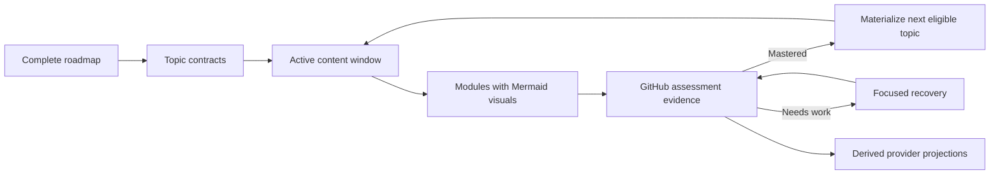
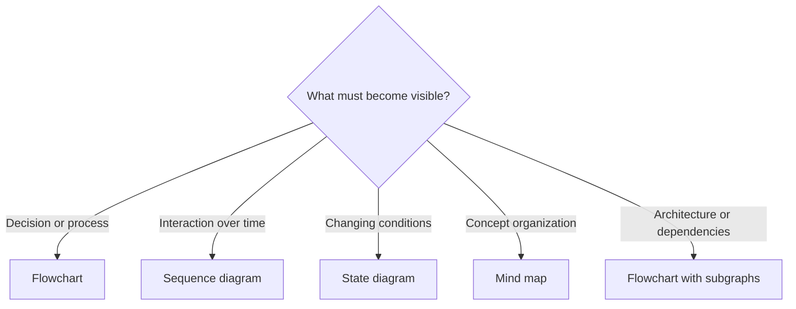
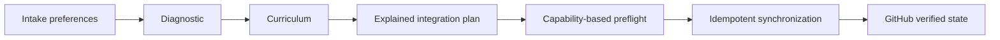
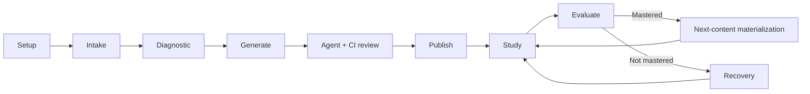

# Open Study Path

Open-source, AI-assisted template for creating, managing and adapting personalized learning paths.

> **This repository is the template, not a learning-path instance.** Learner curricula, progress and external resources belong only in a fork or repository created from this template.

## Core model

Open Study Path separates five concerns:

1. **Roadmap** — the complete dependency-aware learning path.
2. **Topic contracts** — concise approved definitions of capability, effort, evidence and mastery.
3. **Materialized content** — complete lessons, visual models, formative artifacts, rubrics and assessment forms for the active study window.
4. **Integration plan** — contextual capability recommendations with explanation, authority and fallback.
5. **Execution projections** — tasks, calendars, habits, flashcards, artifacts and analytics derived from GitHub state.

GitHub is the only source of truth for curriculum, content, assessment, mastery and verified progress. External providers enrich execution and practice without creating competing learning truth.



The diagram shows the durable loop: plan the whole path, teach only slightly ahead, evaluate with GitHub evidence and synchronize optional tools from the verified result.

## Adaptive rolling generation

Initial curriculum generation always creates the full roadmap and every topic contract. Detailed content follows `content_generation` in `.open-study-path/instance.yml`.

The default strategy is:

```yaml
content_generation:
  strategy: adaptive_rolling_window
  lookahead_topics: 2
  full_upfront_max_topics: 4
  full_upfront_max_hours: 4
  adapt_future_modules_from_assessments: true
  visual_learning:
    mermaid_enabled: true
    roadmap_dependency_diagram_required: true
    minimum_diagrams_per_materialized_module: 1
    diagrams_must_be_explained: true
```

A small curriculum within both thresholds may be generated completely upfront. A larger curriculum materializes only the first two topics. After a topic is mastered, the agent automatically materializes the next eligible content in the same evaluation operation, validates and merges the small PR, and updates selected provider projections.

The learner does not need to request generation of each next topic.

## Topic and task granularity

A topic is one coherent independently assessable capability. It should not be a large chapter, but it should also not be a single administrative action.

Default planning targets:

- three to seven focused activities per topic;
- 10–25 minutes per activity;
- 45–90 minutes per topic;
- split above 120 minutes when the capability can be separated responsibly.

This keeps tasks approachable while avoiding dozens of trivial assessments.

## Visual learning with Mermaid

Mermaid is a required teaching tool rather than optional decoration.

- Generated roadmaps show the real dependency graph between topics.
- Every materialized module contains at least one diagram that makes a relationship, decision, sequence, state, timeline, data flow or architecture visible.
- Nontechnical topics can use decision trees, causal flows, conceptual maps and timelines.
- Programming, AWS and system-design topics can use architecture, sequence, state, class, entity-relationship and dependency diagrams.
- Complex topics should use multiple focused views instead of one crowded diagram.
- Every diagram is introduced and explained in prose, and must render in GitHub Markdown.



The diagram type is selected from the learning need, not copied mechanically across modules. See `docs/mermaid-visual-learning.md` for examples and review criteria.

## Capability-based integrations

The intake records preferences and services the learner already uses. After diagnostic and curriculum planning, the agent generates `study/integrations.md`, recommending only capabilities justified by the actual course.

Every recommendation explains:

- what the provider is;
- why it fits the course;
- how and when it will be used;
- expected free-tier use and possible limitations;
- minimum data read or written;
- what authority it has and does not have;
- a provider-independent fallback;
- whether its connection is required or optional.



Preferred providers are contextual defaults, not hard dependencies:

| Capability | Preferred provider | Fallback | Authority |
| --- | --- | --- | --- |
| Research | Consensus | primary sources, official docs, web | supporting evidence only |
| Flashcards | Quizlet | local TSV/Markdown, Ace Quiz Maker | practice only |
| Rich task execution | Trello | Todoist, GitHub Issues, Markdown | execution state only |
| Simple or recurring reminders | Todoist | calendar or chat | no mastery authority |
| Adaptive focus scheduling | Reclaim | Google/Outlook Calendar or none | schedule only |
| Habit consistency | Habitify | manual or task checklist | habits only |
| Canonical visuals | Mermaid | none | versioned visual model |
| External visual workspace | Whimsical | Mermaid | auxiliary artifact |
| Deliverables | Google Drive | GitHub files or alternatives | evidence link only |
| Analytics | Airtable | repository state | `github_to_airtable` read model |
| Course discovery | Coursera, edX, Udemy, Khan Academy | official/public resources | resource discovery only |

Only one task backend is authoritative. Todoist can replace Trello for a simple path or operate as reminder-only auxiliary. Completing a reminder, habit, calendar session or formative quiz never completes a topic.

Optional providers never block the core GitHub/Markdown path. Required selected providers must pass harmless read-only probes before atomic publication. Optional provider failures activate fallbacks and continue.

External resources are indexed in `state/integrations.json` with capability, provider, safe identifier, URL, topic, content version, authority and synchronization status. This file prevents duplicates; it is not a second source of truth.

See `docs/integration-capabilities.md` for recommendation signals, provider boundaries, free-tier policy, Airtable projection rules and idempotency.

## Assessment workflow

Every materialized topic has:

- a complete module in `study/modules/`;
- optional durable flashcards in `study/flashcards/` when pedagogically useful;
- a 100-point rubric in `study/assessments/`;
- a GitHub Issue Form with five open-response prompts;
- deterministic assessment metadata and labels.

After submitting the form, the normal command is:

`Finalizei o TOPIC-001. Avalie minhas respostas.`

The learner does not normally copy the issue number. The agent resolves exactly one valid submission using the topic title, labels, hidden marker and assessment history. It asks for an issue number only when multiple valid candidates remain.

When mastery is insufficient, the agent creates focused recovery and targeted reassessment. Quizlet, Ace Quiz Maker, habits, task completion and calendar attendance may supplement practice or execution but are not durable mastery evidence.

## Start a new learning path

1. Fork this repository or create a repository from it.
2. Create a dedicated ChatGPT Project.
3. Connect GitHub and authorize the instance repository.
4. Copy `templates/chatgpt-project-instructions.md` into the Project Instructions.
5. Replace `OWNER/REPOSITORY` with the exact repository identifier.
6. In the first chat, paste the exact command in **First chat command** below.
7. Complete intake, bounded diagnostic and curriculum generation using the exact commands returned by the agent.
8. Review the generated integration plan and publish only after the curriculum PR is approved and merged.

### First chat command

The recommended zero-configuration intake provider is the GitHub Issue Form already included in the repository. Replace `OWNER/REPOSITORY` and paste this complete command into the first conversation:

```text
Configure OWNER/REPOSITORY as an Open Study Path instance using the GitHub Issue Form as the intake provider.

Read AGENTS.md, .open-study-path/template.yml, templates/instance.yml and instructions/manifest.yml before making changes.

Create and validate only the instance setup files and configure the selected intake method. Do not import intake answers, run the diagnostic, generate the curriculum or publish external tasks yet.

Stop when the instance and intake provider are ready. Return the direct intake URL when applicable, the configuration path when no form exists, and the exact command I should send for the next guided operation.
```

This first operation must finish after instance setup and intake-provider configuration. Intake import, diagnostic, curriculum generation and publication are separate guided operations.

To use another intake provider, replace only the first paragraph with one of these alternatives while keeping the rest of the command unchanged.

**Jotform**

```text
Configure OWNER/REPOSITORY as an Open Study Path instance using Jotform as the intake provider.
```

**Manual YAML**

```text
Configure OWNER/REPOSITORY as an Open Study Path instance using manual YAML as the intake provider.
```

## Guided lifecycle



Each operation ends with a brief result, primary artifact links, material attention items, PR status and one exact command.

Curriculum review, correction, CI validation and safe merge are internal to generation and materialization. The owner is asked only about a genuine unresolved pedagogical or integration-policy decision.

## Integration safety

Before initial publication, the agent classifies selected capabilities as required, optional or disabled and verifies relevant connectors with harmless read-only operations.

- If a required provider is unavailable, the required publication set pauses before external writes.
- If an optional provider is unavailable, the documented fallback is used and the course continues.
- No API key, password or token is requested or stored.
- Paid features are never required without a free or repository-native alternative.

Publication creates one task per topic in the authoritative backend:

- materialized topics receive module, assessment, optional flashcard and granular execution links;
- planned topics show their approved objective, prerequisites and future-materialization state;
- only dependency-ready materialized topics are ready to study.

## Repository map

- `.open-study-path/template.yml` — template-mode guard.
- `AGENTS.md` — operating contract.
- `study.config.example.yml` — learner preferences and capability-provider defaults.
- `templates/instance.yml` — instance workflow, rolling-generation and visual-learning defaults.
- `templates/integrations-plan.md` — contextual recommendation artifact.
- `templates/integrations-state.json` — safe idempotency-state template.
- `instructions/manifest.yml` — lifecycle ordering and internal operations.
- `instructions/30-generate-path.md` — complete roadmap, content window and integration recommendation.
- `instructions/35-review-curriculum.md` — automatic pedagogical, visual and integration review.
- `instructions/40-publish-tasks.md` — capability-based provider publication.
- `instructions/42-integration-preflight.md` — required versus optional connector probes.
- `instructions/55-evaluate-topic.md` — deterministic assessment resolution and grading.
- `instructions/57-materialize-next-content.md` — automatic rolling materialization and provider synchronization.
- `docs/mermaid-visual-learning.md` — diagram selection, examples and review criteria.
- `docs/integration-capabilities.md` — provider selection, authority, fallback and state model.
- `templates/topic.md` — concise topic contract.
- `templates/module.md` — complete teaching module with granular execution, Mermaid and formative-practice contracts.
- `templates/topic-assessment-issue-form.yml` — discoverable assessment submission.
- `scripts/validate_curriculum.py` — rolling curriculum and content validator.
- `scripts/validate_guided_lifecycle.py` — lifecycle, visual and integration regression guard.

## Privacy

Do not commit raw form submissions, diagnostic transcripts, uploaded reference files, credentials, email addresses or unnecessary personal data. Persist only normalized information, safe external identifiers and durable assessment results needed to generate and adapt the learning path.
