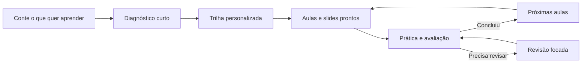

# Open Study Path

Template open source para criar trilhas de estudo personalizadas com ChatGPT e GitHub.

> Este repositório é o template. Cada pessoa cria um repositório próprio a partir dele para guardar sua trilha, aulas, avaliações e progresso.

## O que a experiência entrega

Uma trilha possui:

- um mapa completo do caminho de aprendizagem;
- etapas pequenas, com objetivo e tempo sugerido;
- aulas autocontidas com explicações, exemplos, prática e diagramas;
- slides visuais entregues em um ZIP com HTML que abre no navegador;
- fontes verificáveis e formas alternativas de aprender;
- avaliações com feedback e revisão focada;
- integração opcional com tarefas, agenda e outras ferramentas.

As próximas aulas podem ser preparadas conforme a pessoa avança. Isso permite adaptar exemplos, fontes e prática a partir das avaliações anteriores.

## Conteúdo com fontes

Cada aula pronta mostra de onde vieram as ideias principais, quais partes são síntese ou adaptação pedagógica e onde localizar as fontes consultadas. Uma resposta de plugin ou resultado de busca não é uma fonte final; o módulo registra o documento original e explica como ele foi usado. Recursos pagos nunca são o único caminho.

Veja `docs/content-quality-and-sources.md`.

## Revisão independente

Tudo o que uma instância gera ou altera passa por um papel revisor antes de a operação ser considerada concluída. A autoria e a revisão acontecem em passes separados, mesmo quando o mesmo runtime executa os dois.

A revisão de aulas verifica se cada resultado prometido é realmente ensinado e avaliado. Uma revisão separada confirma que os slides resumem fielmente a aula, cobrem os mesmos resultados, são legíveis e funcionam offline.

Veja `docs/review-framework.md` e `docs/study-slides.md`.

## Linguagem voltada para quem estuda

O GitHub continua usando PRs, CI e arquivos de estado internamente, mas a conversa principal mostra apenas o que ficou pronto, o link necessário, o próximo passo e uma frase curta para continuar. Detalhes técnicos aparecem quando solicitados ou quando explicam um bloqueio.

Veja `docs/learner-facing-language.md`.

## Começar uma nova trilha

1. Use este template para criar um repositório próprio.
2. Aguarde a ação **Prepare ChatGPT Project Instructions** concluir.
3. Abra `templates/chatgpt-project-instructions.md` e confirme a identidade da instância.
4. Crie um Projeto dedicado no ChatGPT.
5. Conecte o GitHub e autorize o repositório da trilha.
6. Copie as instruções preparadas para o Projeto.
7. Envie:

```text
Configure este repositório como uma nova trilha de estudos usando o formulário do GitHub.
```

Depois de preencher o formulário, os comandos naturais são:

```text
Preenchi o formulário. Pode continuar.
Vamos fazer meu diagnóstico.
Crie minha trilha de estudos.
Organize minha trilha nas ferramentas que escolhemos.
Terminei <título da aula>. Avalie minhas respostas.
```

## Ciclo de aprendizagem



O mapa completo é criado desde o início. Em trilhas maiores, apenas as primeiras aulas ficam prontas de imediato. As demais são preparadas automaticamente quando os pré-requisitos são concluídos.

## Estrutura da trilha

- `study/roadmap.md` — visão completa e dependências;
- `study/topics/` — contrato resumido de cada etapa;
- `study/modules/` — aulas completas;
- `study/slides/` — fontes internas, `slides.zip` e metadados;
- `study/assessments/` — rubricas;
- `.github/ISSUE_TEMPLATE/` — formulários de entrada e avaliação;
- `study/integrations.md` — ferramentas que podem ajudar;
- `state/reviews/` — revisões independentes das operações;
- `state/content-reviews/` — revisão semântica das aulas;
- `state/slide-reviews/` — revisão semântica dos slides;
- `state/` — progresso e integrações.

## Aprendizagem visual

O roadmap mostra dependências reais em Mermaid. Cada aula pronta possui ao menos um diagrama útil e explicado.

Depois da revisão da aula, o template produz uma apresentação em HTML semântico e empacota um arquivo `slides.zip`. Dentro dele há um único `slides.html` autocontido. A pessoa baixa o ZIP, extrai o arquivo e abre o HTML no navegador, inclusive offline. Não há geração obrigatória de PDF, Playwright ou Chromium.

Veja `docs/mermaid-visual-learning.md` e `docs/study-slides.md`.

## Integrações por necessidade

Ferramentas externas são escolhidas pelo valor que oferecem, não por estarem disponíveis. Uma ferramenta de tarefas pode organizar a execução; uma agenda pode apoiar a rotina; ferramentas de pesquisa ou entregáveis entram apenas quando a trilha realmente precisa delas. Recursos opcionais nunca bloqueiam o caminho principal no GitHub.

Veja `docs/integration-capabilities.md`.

## Avaliação

Cada aula pronta possui um formulário com cinco questões e uma rubrica de 100 pontos. A pessoa responde com o próprio raciocínio, recebe feedback e, quando necessário, uma revisão focada.

O comando recomendado usa o título da aula:

```text
Terminei <título da aula>. Avalie minhas respostas.
```

## Princípios

- a aula ensina; não é uma lista de links;
- os slides resumem a aula aprovada sem criar um segundo conteúdo;
- o pacote visual abre offline e não depende de um servidor;
- as fontes são verificadas e explicadas;
- exemplos e atividades são personalizados sem expor dados desnecessários;
- toda operação gerada passa por revisão independente;
- ferramentas opcionais nunca bloqueiam o caminho principal;
- conteúdo, slides e avaliações ficam versionados no GitHub;
- detalhes técnicos ficam disponíveis sem ocupar a conversa principal;
- nenhuma credencial ou submissão bruta é versionada.
