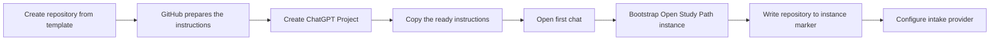

# Set up a ChatGPT Project for an Open Study Path instance

A ChatGPT Project is the recommended workspace for conversations that manage one Open Study Path repository.

## Why store the repository in Project Instructions

Connecting GitHub gives ChatGPT access to authorized repositories, but the project still needs an explicit repository target. Store the exact `OWNER/REPOSITORY` identifier in the ChatGPT Project Instructions so every chat starts with the same target.

The project name and description are useful for human organization, but they are not reliable machine-readable configuration. They may include the repository name, but the exact identifier belongs in Project Instructions.

After instance setup, `.open-study-path/instance.yml` becomes the persistent repository source of truth.

## Automatic preparation

When a repository is created from `diegomoura/open-study-path`, GitHub emits a `push` event for the new repository. The workflow **Prepare ChatGPT Project Instructions** uses the repository identity supplied by GitHub to update `templates/chatgpt-project-instructions.md`.

The prepared file:

- replaces every `OWNER/REPOSITORY` occurrence;
- records the resolved identity in a hidden marker;
- can be executed again safely;
- updates the identifier after a repository rename on the next default-branch push or manual run.

GitHub cannot paste text into the ChatGPT Project interface. Copying the prepared instructions remains the only manual step.



## Setup steps

1. Create a repository from `diegomoura/open-study-path` by using the GitHub template.
2. Wait for **Prepare ChatGPT Project Instructions** to finish in the Actions tab.
3. Open `templates/chatgpt-project-instructions.md` in the new repository.
4. Confirm that **Instance** contains the exact `owner/repository` value instead of `OWNER/REPOSITORY`.
5. Create a new ChatGPT Project dedicated to that learning path.
6. Connect GitHub to ChatGPT and authorize access to the new repository.
7. Connect Jotform, Trello, Google Calendar or Gmail only when those integrations will be used.
8. Copy the prepared file into the ChatGPT Project Instructions without editing the repository value.
9. Optionally name the ChatGPT Project after the learning subject and repository.
10. Open the first chat and send the setup prompt below.

If the workflow did not run or could not write because of repository policy, open **Actions → Prepare ChatGPT Project Instructions → Run workflow**. Manual replacement remains a fallback, not the normal path.

## First-chat prompt

```text
Use the repository defined in this project's instructions.

Set it up as an Open Study Path instance and ask me which intake provider to use.
Do not import a submission, generate the curriculum or publish tasks yet.
```

## Guided curriculum generation

The curriculum generation command authorizes the complete proposal workflow inside that phase:

1. create a draft pull request;
2. review it against intake, diagnostic and repository contracts;
3. correct issues on the proposal branch;
4. run all required checks;
5. self-review the final diff;
6. mark the curriculum approved and merge when no owner decision remains;
7. return the task-publication command.

The owner should not need to send a separate curriculum-review command or manually merge a valid proposal. The agent leaves the pull request open only when it needs one specific pedagogical decision.

## Updating an existing ChatGPT Project

Project Instructions are copied text; they do not automatically update inside ChatGPT when the repository template changes. After a lifecycle-contract update, run or wait for **Prepare ChatGPT Project Instructions**, then replace the existing Project Instructions with the latest prepared file.

The repository identity is preserved automatically. This is a one-time synchronization for each existing ChatGPT Project after a contract update. Repository contracts in `AGENTS.md` and `instructions/manifest.yml` remain the operational source for each run, but stale Project Instructions can conflict with newer behavior.

## Identity resolution rules

During the first setup, the repository target comes from the prepared ChatGPT Project Instructions or an explicit repository identifier in the user's message.

The agent must verify that the accessible repository matches that identifier before writing files. It then records the exact value in `.open-study-path/instance.yml`.

After the instance marker exists:

- `.open-study-path/instance.yml` is the repository source of truth;
- the ChatGPT Project Instructions remain the bootstrap and conversation context;
- a mismatch between the two must stop write operations until the owner resolves it;
- the project title and description never override either source.

## One project per instance

Use one ChatGPT Project per Open Study Path instance. This prevents conversations, attachments, integration identifiers and instructions from being mixed between unrelated learning paths.

A single repository should also represent one active learner instance unless the repository intentionally implements a multi-learner extension.
