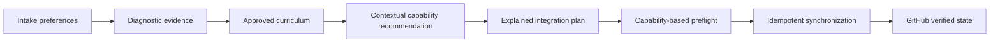
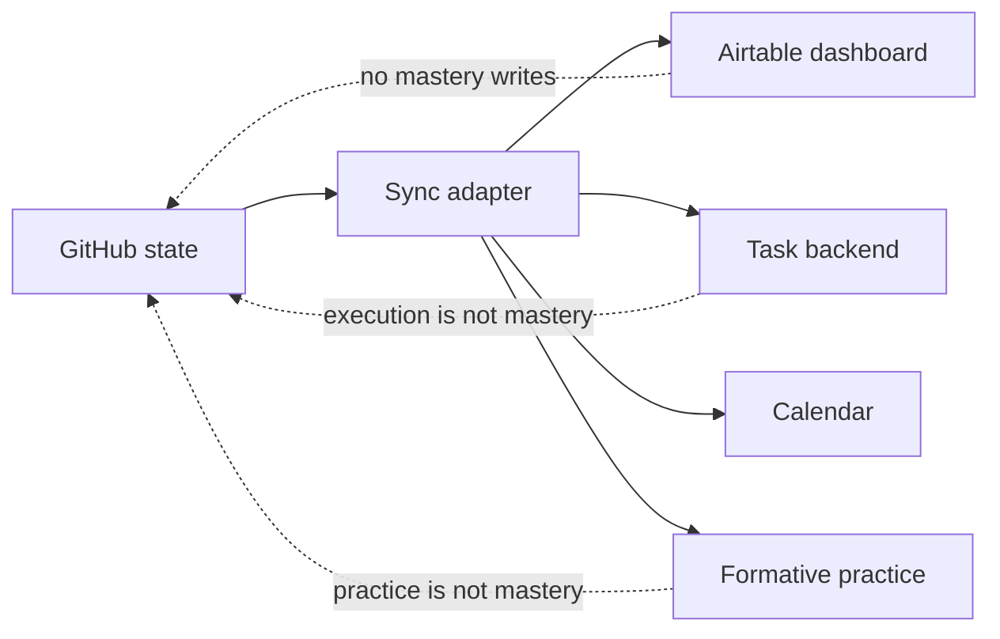

# Capability-based integrations

Open Study Path selects integrations from learning needs rather than maintaining a fixed list of required apps. A provider is an implementation of a capability. GitHub remains the only source of truth for curriculum, content, assessment, mastery and verified progress.

The plan is generated only after the agent understands the subject, learner, scope and active content window. Optional providers never block the core GitHub/Markdown path.

## Capability catalog

| Capability | Preferred provider | When it helps | Durable fallback | Authority |
| --- | --- | --- | --- | --- |
| Source of truth | GitHub | every path | none | curriculum, assessment, mastery |
| Research | Consensus | empirical or scientific claims | primary sources, official docs, web | supporting evidence only |
| Formative practice | Quizlet | terms, commands, formulas and recall | Markdown/TSV flashcards, Ace Quiz Maker | practice only |
| Task management | Trello | rich courses and visual execution | Todoist, GitHub Issues, Markdown | execution state only |
| Recurring reminders | Todoist | simple repeated actions | calendar or chat | no task or mastery authority |
| Scheduling | Reclaim | variable agenda and protected focus | Google/Outlook Calendar or none | schedule only |
| Habit tracking | Habitify | consistency and routines | manual tracking | habits only |
| Canonical visuals | Mermaid | every generated course | none | versioned visual model |
| External visuals | Whimsical | editable or collaborative maps | Mermaid | auxiliary artifact |
| Artifact workspace | Google Drive | Docs, Sheets, Slides and evidence | GitHub files | evidence link only |
| Analytics projection | Airtable | dashboards across courses | repository state | read-model only |
| Course discovery | Coursera, edX, Udemy, Khan Academy | selected external lessons | public or official resources | resource discovery only |

## Recommendation signals

### Quizlet

Recommend when the course contains a meaningful body of atomic recall material: terminology, definitions, commands, formulas, classifications, comparisons or common errors. Generate a durable local flashcard artifact before or alongside external synchronization. A Quizlet score never changes mastery.

### Consensus

Recommend or use conditionally for empirical claims, research comparisons and evidence-based topics. Prefer official documentation and primary technical sources for APIs, programming languages, cloud products and standards. Record source locators in the materialized module.

### Reclaim

Recommend when availability is irregular, sessions need to be protected or conflicts should be resolved dynamically. Respect free-plan constraints from the learner configuration. Use fixed calendar blocks when the connected Reclaim capability is unavailable.

### Habitify

Recommend only when consistency is a material risk. Keep the default to at most three habits. The normal set is study session, active recall and spaced review. Habit completion is never mastery evidence.

### Trello and Todoist

Trello is preferred for most rich courses because it can show the whole roadmap, links, checklists, recovery and states. Todoist may replace Trello for a short or simple path. It may also be auxiliary for recurring reminders, but auxiliary reminders cannot modify the authoritative task state.

### Whimsical

Recommend for collaborative, learner-editable or spatial diagrams. Mermaid remains canonical and must be sufficient to understand the concept without the external board.

### Airtable

Use only as a unidirectional analytical projection:

Suggested Airtable tables are Courses, Topics, Attempts, Study Sessions and Integrations. Every row derived from GitHub should include its source repository, source path or issue, content version and last synchronization timestamp.

## Explanation card contract

Every recommended provider must be explained using all fields below:

1. what it is;
2. why it fits this course;
3. how it will be used;
4. when it activates;
5. access and possible free-tier limits;
6. minimum data read or written;
7. authority boundaries;
8. fallback;
9. preflight class;
10. decision status.

Do not assume the learner knows a provider by name. Avoid marketing language and do not promise that a free plan contains a capability without verifying it during use.

## Required and optional preflight

Connections are classified by the selected integration plan:

- `required_for_selected_publication`: failure pauses writes that must remain atomic together;
- `optional_probe`: failure records the provider as unavailable and immediately uses the fallback;
- `not_enabled`: no probe and no write.

GitHub access is always required. A selected primary task backend may be required for publication. Research, flashcards, reminders, habits, external visuals, artifact workspaces, analytics and course discovery are optional unless the owner explicitly promotes a capability to required.

## Idempotency

`state/integrations.json` is an index, not a second source of learning truth. Each external resource records capability, provider, external identifier, URL, topic, content version, authority, synchronization status and timestamp. Search both this state file and the provider before creating anything.

## Free-tier policy

When `integration_preferences.free_tier_only` is true:

- do not require paid features;
- prefer free-capability adapters;
- explain known limits without guaranteeing current pricing;
- provide a free or repository-native fallback;
- never block the course because an optional provider requires payment.

## Security

Read probes must be harmless and minimal. Never request or persist API keys, passwords, tokens, raw intake submissions or unnecessary identity data. External providers may not silently change the approved curriculum.
