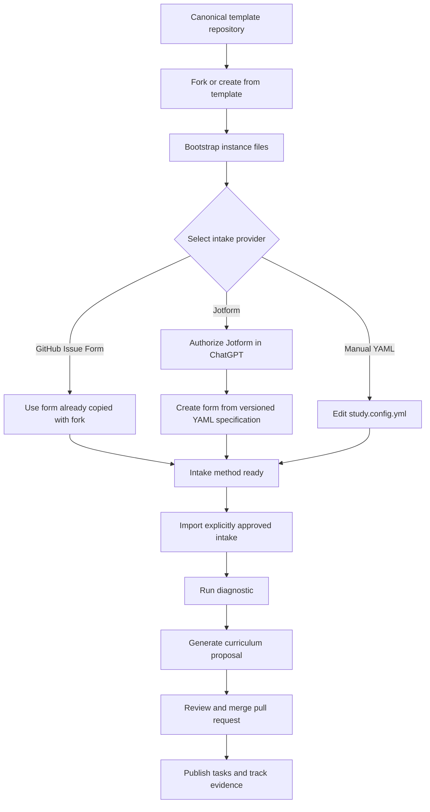

# Template and instance lifecycle

Open Study Path separates the reusable engine from each learner's generated content and external integrations.

## Template mode

Template mode contains reusable contracts only. The canonical repository has `.open-study-path/template.yml` and no `.open-study-path/instance.yml`.

Allowed changes:

- improve instructions and schemas;
- improve intake specifications;
- improve generated-file templates;
- test validation and documentation.

Forbidden changes:

- learner-specific configuration;
- learner-owned Jotforms or integration identifiers;
- imported submissions;
- generated roadmaps or topics;
- learner task boards and calendar events;
- progress or achievement state.

## Fork setup

A fork is not automatically an instance. The owner explicitly asks an agent to set it up.

Setup has two internal phases:

1. bootstrap the empty instance files;
2. configure one intake provider.

Setup stops when the intake method is ready. It does not import a response or generate a curriculum.

## Intake providers

### GitHub Issue Form

The form under `.github/ISSUE_TEMPLATE/create-study-path.yml` is copied into every fork. It requires no external authorization and is the recommended zero-configuration option.

### Jotform

The owner authorizes the Jotform app in ChatGPT. The agent creates an instance-owned form from `intake/jotform-form-spec.yml`, persists only its ID, URL and specification version, and then stops. No maintainer form is shared across instances.

### Manual YAML

The owner may enter the required facts directly in `study.config.yml`. Placeholder defaults are not treated as confirmed learner answers.

## Instance mode

Instance mode begins when `.open-study-path/instance.yml` is created in a repository other than the canonical template. The instance may then configure intake, import an approved response, generate its learning path and connect optional task or calendar backends.

## Updating from the template

Instance repositories should keep learner-generated files separate from reusable template files so upstream template changes can be compared and merged without replacing progress, integration identifiers or study content.
