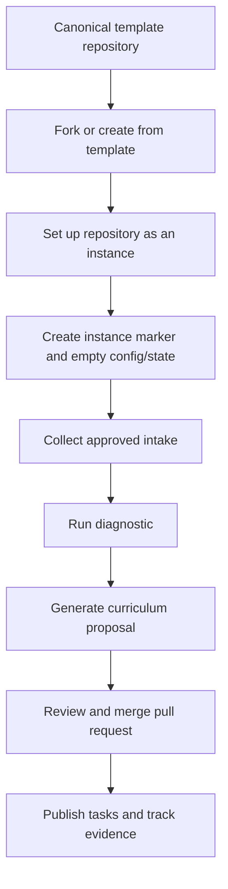

# Template and instance lifecycle

Open Study Path separates the reusable engine from each learner's generated content.

## Template mode

Template mode contains reusable contracts only. The canonical repository has `.open-study-path/template.yml` and no `.open-study-path/instance.yml`.

Allowed changes:

- improve instructions and schemas;
- improve intake specifications;
- improve generated-file templates;
- test validation and documentation.

Forbidden changes:

- learner-specific configuration;
- imported submissions;
- generated roadmaps or topics;
- learner task boards and calendar events;
- progress or achievement state.

## Fork setup

A fork is not automatically an instance. The user explicitly asks an agent to set it up. Setup creates empty instance artifacts but stops before importing intake or generating a curriculum.

## Instance mode

Instance mode begins when `.open-study-path/instance.yml` is created in a repository other than the canonical template. The instance may then import approved intake, generate its learning path and connect optional task or calendar backends.

## Updating from the template

Instance repositories should keep learner-generated files separate from reusable template files so upstream template changes can be compared and merged without replacing progress or study content.
