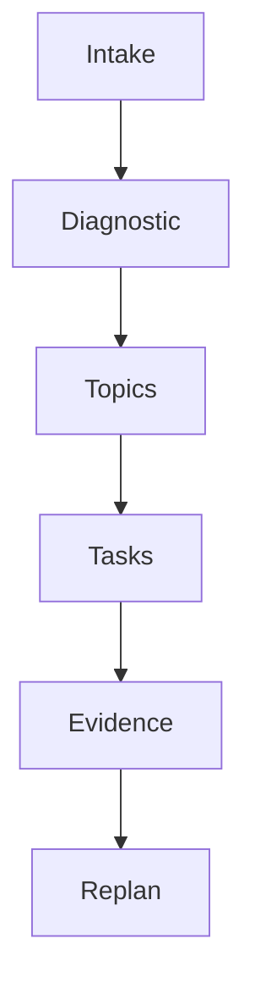

# Study Roadmap

This file is generated after intake normalization and diagnostic assessment.

## Current status

No learning path has been generated yet.

## Generation rules

- Topics are ordered by prerequisites.
- Weekly dates are projections, not structural units.
- A topic is complete only after evidence satisfies its mastery criteria.
