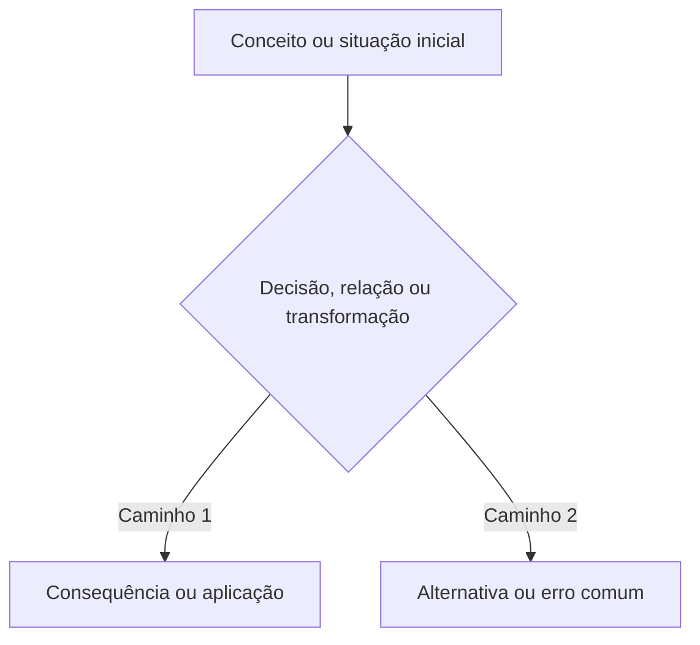

# TOPIC-000 — Replace me

## Como usar este módulo

Explique a sequência de estudo, o tempo sugerido e o que o estudante deverá produzir. Este arquivo deve ser uma aula autocontida, não apenas uma lista de tarefas.

## Plano de execução

Divida a experiência em três a sete ações pequenas e verificáveis. Cada ação deve normalmente durar entre 10 e 25 minutos. Evite uma única linha que misture leitura, exercício, entrega e avaliação.

- [ ] Recuperar pré-requisitos (10 min)
- [ ] Estudar o primeiro bloco conceitual (20 min)
- [ ] Refazer exemplos e prática guiada (15 min)
- [ ] Produzir a evidência independente (15 min)

## Objetivos de aprendizagem

Ao final, o estudante deverá conseguir:

- explicar o conceito central com palavras próprias;
- aplicar o conceito a uma situação nova;
- reconhecer erros ou interpretações comuns;
- produzir a evidência exigida pelo tópico.

## Verificação de pré-requisitos

Inclua duas ou três perguntas curtas ou tarefas de recuperação ativa. Dê orientação para revisar o tópico anterior quando necessário.

## Conteúdo essencial

Ensine efetivamente o conteúdo em linguagem adequada ao nível configurado. Inclua definições, relações entre conceitos, limites, nuances e raciocínio. Não use placeholders como “estude o conceito”.

## Mapa visual

Introduza o que o diagrama representa e por que ele ajuda a compreender este tópico. Todo módulo materializado deve conter ao menos um diagrama Mermaid útil e explicado. Temas complexos podem usar vários diagramas separados.

Escolha o tipo adequado: `flowchart`, `mindmap`, `timeline`, `stateDiagram-v2`, `sequenceDiagram`, `classDiagram` ou `erDiagram`. Em arquitetura de software ou nuvem, use `flowchart` com `subgraph` para componentes e limites quando isso renderizar de forma mais confiável no GitHub.

Depois do diagrama, explique em palavras o que o estudante deve observar, como as partes se relacionam e quais limitações o desenho não mostra. Não deixe o diagrama solto e não o use como substituto da explicação textual.

## Exemplos trabalhados

Apresente ao menos dois exemplos resolvidos passo a passo, incluindo um caso simples e um caso com ambiguidade ou erro comum.

## Erros comuns e como corrigi-los

Liste equívocos prováveis, explique por que estão errados e mostre como reformular o raciocínio.

## Prática guiada

Inclua exercícios com pistas graduais. Não revele imediatamente a resposta completa; mostre critérios para o estudante conferir o próprio raciocínio.

## Prática independente

Inclua tarefas que exijam transferência para um caso novo e produção do entregável definido no tópico.

## Prática formativa e revisão

Quando o tópico tiver definições, comandos, fórmulas, classificações, comparações ou erros comuns adequados à recuperação ativa, defina `flashcards: study/flashcards/TOPIC-000.tsv` no frontmatter e gere o arquivo com colunas `Front`, `Back` e `Tags`.

Linke o arquivo local, que é o fallback durável e deve funcionar sem conta externa. Quando Quizlet for selecionado e sincronizado, adicione também o link do conjunto externo sem remover o fallback. Ace Quiz Maker pode ser sugerido para checagem rápida em chat.

Explique explicitamente que flashcards e quizzes são prática formativa. Pontuação, sequência ou conclusão nessas ferramentas não determina domínio do tópico.

Quando flashcards não forem pedagogicamente úteis, mantenha `flashcards: null` e explique brevemente por que a prática principal exige aplicação, produção ou raciocínio mais longo.

## Síntese por recuperação ativa

Inclua perguntas que possam ser respondidas sem consultar o texto e uma breve orientação de revisão espaçada.

## Entregável e evidência

Descreva exatamente o que deve ser produzido e como vincular ou transcrever a evidência no formulário de avaliação. Quando o entregável estiver em Google Drive ou outro workspace externo, preserve um link seguro e deixe claro que o resultado oficial da avaliação permanece no GitHub.

## Avaliação do tópico

Use o Issue Form específico do tópico. Depois de enviar as respostas, retorne ao chat com:

`Finalizei o TOPIC-000. Avalie minhas respostas.`

O número da issue só deve ser solicitado quando a busca determinística encontrar mais de uma submissão candidata.

Checklist, lembrete, sessão agendada, hábito ou resultado formativo não substitui esta avaliação.

## Referências

Liste fontes primárias ou oficiais com localizador canônico. Para pesquisa acadêmica descoberta com Consensus ou outro provedor, registre a fonte verificável; não cite apenas a resposta do plugin. Para cursos externos, identifique seção ou aula, acesso e alternativa gratuita quando aplicável.
