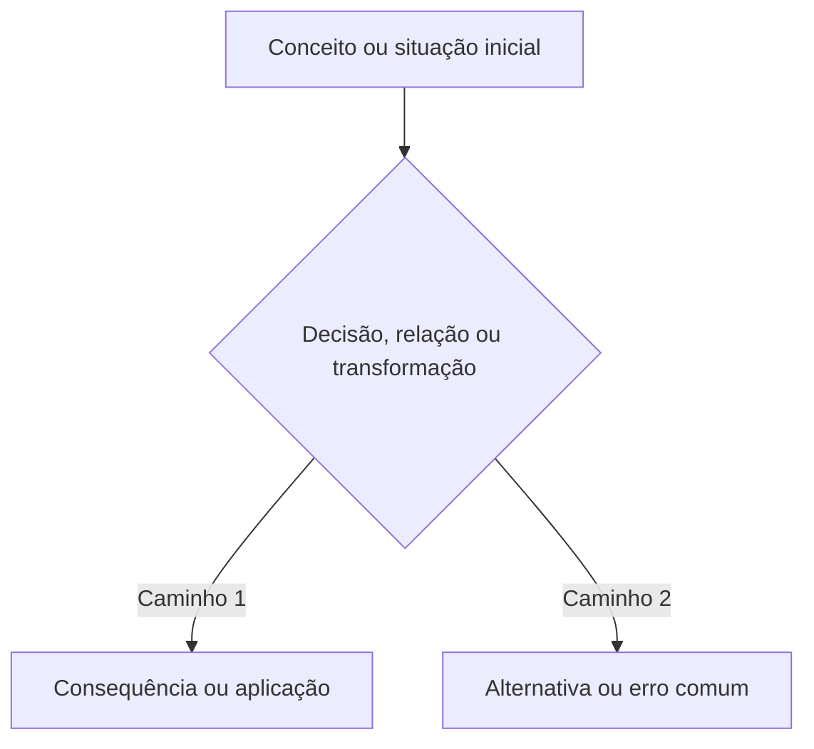

# TOPIC-000 — Replace me

## Antes de começar

Explique em poucas linhas o que a pessoa vai aprender, por que isso importa para o objetivo dela, quanto tempo reservar e o que produzir ao final. Este arquivo deve ser uma aula autocontida, não apenas uma lista de tarefas.

## Sua sessão de estudo

Divida a experiência em três a sete ações pequenas e verificáveis. Cada ação deve normalmente durar entre 10 e 25 minutos. Os tempos são sugestões, não limites rígidos.

- [ ] Recuperar o que já sei (10 min)
- [ ] Estudar e explicar a ideia central (20 min)
- [ ] Refazer exemplos e prática guiada (15 min)
- [ ] Produzir a evidência independente (15 min)

## O que você vai aprender

Ao final, você deverá conseguir:

- explicar o conceito central com palavras próprias;
- aplicar o conceito a uma situação nova;
- reconhecer erros ou interpretações comuns;
- produzir a evidência exigida pela etapa.

## Recupere o que já sabe

Inclua duas ou três perguntas curtas ou tarefas de recuperação ativa. Dê orientação clara para revisar a etapa anterior quando necessário.

## Conteúdo essencial

Ensine efetivamente o conteúdo em linguagem adequada ao nível configurado. Inclua definições, relações entre conceitos, limites, nuances e raciocínio. Não use placeholders como “estude o conceito”.

As afirmações centrais devem poder ser rastreadas até as fontes listadas no final. Diferencie claramente:

- o que vem de fonte primária, documentação oficial ou pesquisa;
- o que é síntese do agente;
- o que é exemplo ou adaptação pedagógica criada para esta trilha.

## Mapa visual

Introduza o que o diagrama representa e por que ele ajuda. Todo módulo pronto deve conter ao menos um diagrama Mermaid útil e explicado.

Depois do diagrama, explique o que observar, como as partes se relacionam e quais limitações o desenho não mostra. Não deixe o diagrama solto e não o use como substituto da explicação.

## Exemplos trabalhados

Apresente ao menos dois exemplos resolvidos passo a passo, incluindo um caso simples e um caso com ambiguidade, limite ou erro comum.

## Erros comuns e como corrigir

Liste equívocos prováveis, explique por que falham e mostre como reformular o raciocínio.

## Prática guiada

Inclua exercícios com pistas graduais. Não revele imediatamente a resposta completa; mostre critérios para a pessoa conferir o próprio raciocínio.

## Prática independente

Inclua tarefas que exijam transferência para um caso novo e produção do entregável definido no tópico.

## Pratique e revise

Quando o tópico tiver definições, comandos, fórmulas, classificações, comparações ou erros comuns adequados à recuperação ativa:

- defina `flashcards: study/flashcards/TOPIC-000.tsv`;
- defina `flashcards_study: study/flashcards/TOPIC-000.md`;
- gere o TSV com colunas `Front`, `Back` e `Tags`;
- gere o Markdown com cartões expansíveis usando `
` e `
`.

Dentro da aula, mantenha as alternativas duráveis: **Estudar os flashcards no GitHub**, **Baixar ou importar o TSV** e, quando existir um conjunto real, **Praticar no Quizlet**. A pessoa pode escolher o formato que melhor ajuda.

A ferramenta de tarefas não deve repetir todos esses links. Conforme `instructions/40-publish-tasks.md`, o cartão mostra somente um recurso principal de prática: Quizlet quando o conjunto atual existe; Markdown quando o recurso externo não está disponível; TSV apenas quando importação é a ação pretendida.

Explique uma única vez, em linguagem natural: os flashcards ajudam a praticar; a etapa é concluída pela avaliação.

Quando flashcards não forem úteis, mantenha os campos como `null` e explique qual prática substitui a memorização.

## Outras formas de aprender

Selecione somente formatos que realmente acrescentem uma perspectiva ou demonstração útil. Podem incluir:

- vídeo curto ou trecho específico de aula;
- aula universitária aberta;
- podcast;
- laboratório ou demonstração interativa;
- capítulo ou exercício de curso;
- artigo, TCC, dissertação ou paper relevante.

Para cada recurso, diga **por que usar**, **qual trecho estudar**, **quanto esforço exige**, **idioma/legendas quando relevante** e **condição de acesso**. Recursos potencialmente pagos precisam de uma alternativa gratuita ou oficial.

## Confira sem consultar

Inclua perguntas que possam ser respondidas sem olhar o texto e uma orientação breve de revisão espaçada.

## O que você vai produzir

Descreva exatamente o entregável e como vincular ou transcrever a evidência no formulário. Não peça dados pessoais desnecessários.

## Avaliação

Construa o link direto usando a identidade exata da instância:

`https://github.com/OWNER/REPOSITORY/issues/new?template=assessment-topic-000.yml`

Apresente como **Abrir a avaliação de <título da aula>**. Não apresente somente o nome interno `assessment-topic-000.yml`.

Depois do envio, peça uma frase natural:

`Terminei <título da aula>. Avalie minhas respostas.`

Continue aceitando `Finalizei o TOPIC-000. Avalie minhas respostas.` como alias técnico. O número da issue só deve ser solicitado quando houver mais de uma submissão candidata.

## Como este conteúdo foi construído

Explique em um parágrafo quais fontes sustentaram as ideias centrais e quais diagramas, exemplos ou exercícios foram criados como adaptação pedagógica. Declare simplificações, divergências ou limites importantes.

## Fontes e caminhos para aprofundar

Inclua de três a sete fontes realmente consultadas. Sempre que existirem, combine uma fonte primária ou oficial, uma explicação confiável e um formato complementar útil.

| Tipo | Fonte | Como foi usada nesta aula | Acesso |
| --- | --- | --- | --- |
| Primária ou oficial | Autor, obra, seção e link direto | Base do conceito central | público / biblioteca / pago |
| Acadêmica ou técnica | Título, instituição, seção e link | Conferência de definições, evidência ou limites | público |
| Vídeo, aula ou curso | Título, autor/canal, trecho ou timestamp e link | Explicação alternativa ou demonstração | público, idioma e legendas |

Links sem explicação não bastam. Inclua capítulo, seção, página, DOI, aula, exercício ou timestamp. Não cite uma resposta de plugin como fonte; cite o documento original. Siga `docs/content-quality-and-sources.md`.
