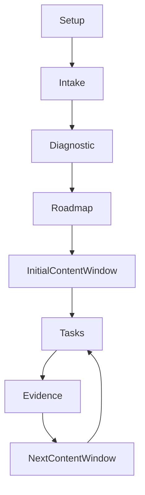

# Study Roadmap

This file is created in an Open Study Path instance after setup. The complete topic graph is generated after approved intake and diagnostic assessment. Detailed lessons may be materialized progressively according to `.open-study-path/instance.yml`.

## Current status

The instance is configured, but no learning path has been generated yet.

## Generation rules

- The complete dependency graph and every topic contract are planned upfront.
- Detailed modules and assessments may use an adaptive rolling window.
- A topic is a coherent assessable capability; small execution actions live inside it.
- Activities normally take 10–25 minutes and topics normally take 45–90 minutes.
- Weeks and dates are projections, not structural learning units.
- A topic is complete only after verified evidence satisfies its mastery criteria.

## Materialization status

When the curriculum exists, list every topic with one content state:

- `materialized` — module, rubric and assessment form are ready;
- `planned` — approved contract exists and detailed content will be generated automatically when the topic enters the active window.
